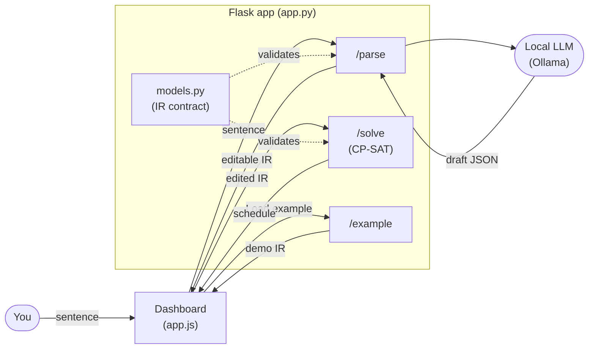

# Architecture

A friendly tour of this app for someone who has never touched a constraint solver. By the end
you should understand what the app does, how the pieces fit together, and — the main event —
**how CP-SAT actually works**, taught through this project's lake example.

---

## 1. What the app does, and why

You type a sentence describing your day:

> _"Go to Lake Michigan, leave after 8 AM, grab a hamburger, sail, maybe kiteboard — and if I
> can't kiteboard, sail twice as long — be home by 10 PM."_

The app turns that into an actual **schedule**: concrete start and end times for each activity
that respect every rule you stated. If no schedule can possibly satisfy all the rules, it tells
you that too ("INFEASIBLE") instead of quietly handing you a broken plan.

The trick is that it does this in three stages, and the middle stage is the important one:

```
sentence  ->  editable typed JSON (the "IR")  ->  CP-SAT solver  ->  dashboard schedule
          (local LLM drafts)   (you review/edit)  (does the math)   (Gantt chart)
```

1. **Sentence → JSON.** An LLM — a local Ollama model — reads your sentence and drafts a structured list of
   activities and constraints. This JSON is called the **IR** — the *intermediate representation*.
   Think of it as a typed, machine-readable form of your sentence.

2. **You review and edit the JSON.** The dashboard shows each rule as an editable card. This is
   the **reliability idea** at the heart of the project. An LLM can hand you a clean-looking
   schedule that has *silently dropped one of your rules* — and you'd never know, because the
   output looks plausible. So we don't trust the LLM to produce the *answer*. We only trust it
   to *draft the rules*, and then we make those rules visible and editable. Every constraint
   carries the exact `source` phrase it came from, so you can check "be home by 10 PM" really
   did become a 10 PM deadline. The JSON, not the LLM's prose, is the source of truth.

3. **JSON → schedule.** CP-SAT (Google's constraint solver, part of OR-Tools) takes the
   reviewed JSON and computes a schedule that provably satisfies every enabled rule, or proves
   that none exists.

Everything runs locally in one small Flask app. No database, no build step, no hosting. The
dashboard and the solver work without any LLM — only the sentence-parsing step calls a local Ollama model (no API key, nothing leaves your machine).

---

## 2. The pieces and the data flow

The whole thing is one Flask app (`app.py`) serving a single-page dashboard plus three JSON
endpoints.

| File | Role |
| --- | --- |
| `app.py` | Flask routes: `/` (dashboard), `/parse` (one sentence → JSON), `/upload` + `/extract` (a `.docx` → JSON), `/solve` (JSON → schedule via CP-SAT), `/example` (hand-written demo IR). |
| `models.py` | The IR defined as Pydantic types — the single JSON contract shared by every route, dashboard, and solver. |
| `parse.py` | Calls a local Ollama model to turn ONE sentence into a validated `Scenario`, with one repair retry. |
| `ingest.py` | Uses python-docx to turn a `.docx` into ordered structured blocks (section, requirement ids, dates), preserving provenance. |
| `extract.py` | Map-reduce: chunks the blocks, drafts each chunk with the local model, merges into one multi-day `Scenario`, and emits a coverage report. |
| `solver.py` | The CP-SAT core: turns a `Scenario` into a solver model (single-day OR multi-day) and solves it; `explain_infeasibility` names conflicts. |
| `templates/index.html`, `static/app.js`, `static/style.css` | The vanilla-JS dashboard: editable cards + a zoomable multi-day Gantt + the coverage panel. |
| `examples/lake.json`, `examples/project.json` | Hand-written IRs (single-day, multi-day) so you can exercise `/solve` without the LLM. |
| `smoke.py` | The runnable green-gate tests + `verify_schedule`. |

### The routes

- **`GET /`** — serves `index.html`, the dashboard.
- **`POST /parse`** — body is `{"sentence": "..."}`. Hands it to `parse_sentence()`, which calls
  a local Ollama model and returns the validated IR as JSON.
- **`POST /upload`** — multipart `.docx`. Returns structured blocks + a coverage summary (parsed
  in-memory; nothing is saved to disk).
- **`POST /extract`** — body is `{"blocks": [...]}` from `/upload`. Runs the local map-reduce
  pipeline and **streams** per-chunk progress (Server-Sent Events), ending with the validated
  multi-day `Scenario`, a coverage report, and any warnings.
- **`POST /solve`** — body is a full IR (the edited JSON). Validates it against `models.Scenario`,
  runs `solve()`, returns `{"status": ..., "schedule": [...]}` (plus `horizon`/`start_date` for
  multi-day, and a `conflict` explanation when INFEASIBLE).
- **`GET /example[/<name>]`** — returns a hand-written demo IR (default `lake`), so "Load example"
  works with no LLM involved.

### The IR (`models.py`)

The IR is two lists — `activities` and `constraints` — plus an optional `day` window.

- An **`Activity`** is just an `id` and a `duration` in minutes, e.g. `{"id": "sail", "duration": 120}`.
- A **`Constraint`** is one of five typed variants, picked by its `type` field (Pydantic calls
  this a *discriminated union* — it reads `type` to know which shape to expect):
  - `time_window` — an `earliest` start and/or `latest_end` for one activity.
  - `no_overlap` — a set of activities (or `"all"`) that can't run at the same time.
  - `precedence` — one activity must finish before another starts.
  - `sequence` — an ordered list of activities where each one finishes before the next starts. It's
    just `precedence` generalized to a whole chain: N activities expand to N−1 adjacent precedences,
    so "first A, then B, finally C" is one rule instead of several pairwise ones.
  - `conditional` — a `when` / `then` rule, e.g. *when* kiteboard is absent, *then* set sail's
    duration ×2.

Every constraint also carries `enabled` (a toggle so you can switch a rule off without deleting
its numbers), `label` (a human title), and `source` (the phrase it came from). Each constraint
`type` maps almost 1:1 to a CP-SAT call in `solver.py`.

The Scenario also has an optional **`day`** window — a `DayWindow` with a `start` and `end`
(both `"HH:MM"`), e.g. `{"start": "08:00", "end": "22:00"}`. Unlike a `time_window` (which limits
one activity), the day window bounds **every** activity to that span and anchors the schedule to
the day's start, so it packs from there. Omit `day` entirely and activities are free across the
full 0–24h day.

### How it flows



On the front end, `static/app.js` is tiny: "Parse" POSTs the sentence to `/parse` and renders
the returned constraints as editable cards; "Load example" pulls `/example`; "Solve" POSTs the
current (possibly edited) JSON to `/solve` and draws each scheduled activity as a positioned bar
on a 24-hour timeline. When you edit a field, you're editing the JSON in place; the next "Solve"
sends the new numbers.

---

## 3. How CP-SAT actually works (taught with the lake example)

This is the part worth slowing down for. We'll use the concrete numbers from
`examples/lake.json` throughout.

### What a constraint solver even is

Normal code computes an answer step by step: you tell it *how*. A constraint solver flips this
around: you describe *what a valid answer looks like* — the rules it must obey — and the solver
searches for values that satisfy all of them at once. You never write the search; CP-SAT does it.

**CP-SAT** is the solver from Google OR-Tools. "CP" is *constraint programming*; "SAT" is the
*satisfiability* engine underneath it. You hand it variables and constraints; it returns an
assignment of values that makes everything true, or tells you that's impossible.

Three things you give it:

- **Decision variables** — the unknowns the solver gets to choose. Here: when each activity
  starts and ends.
- **Constraints** — rules those variables must obey (no overlaps, deadlines, ordering, …).
- An **objective** (optional) — a number to make as large or small as possible, used to pick the
  *best* valid answer among many.

### Time is just integers

The whole day is modeled as **minutes from midnight**, `0` to `1440` (24 × 60). So `08:00` is
`480`, `21:00` is `1260`, `22:00` is `1320`. `solver.py` has a tiny `_to_minutes()` helper that
does this conversion. Working in plain integers is exactly what CP-SAT likes.

### Decision variables: start and end times

For each activity, `solver.py` creates two integer **decision variables** — a start and an end,
each allowed to be anywhere from 0 to 1440:

```python
starts[aid] = model.new_int_var(0, DAY, f"start_{aid}")
ends[aid]   = model.new_int_var(0, DAY, f"end_{aid}")
```

So for `sail` the solver must pick a `start_sail` and an `end_sail`. It doesn't know them yet —
that's the whole point. The constraints will pin them down.

### Interval variables: an activity as a block of time

An activity isn't two loose numbers — it's a *block* with a duration. CP-SAT has a purpose-built
type for this, the **interval variable**, which ties together start, size (duration), and end so
that `start + size = end` always holds:

```python
interval = model.new_interval_var(starts[aid], duration, ends[aid], f"iv_{aid}")
```

For `sail` the duration is 120, so its interval is a 2-hour block; wherever its start lands, the
end is automatically 120 minutes later. Intervals are what the scheduling constraints below
operate on.

### no_overlap: one thing at a time

The lake scenario has a `no_overlap` constraint over `"all"` activities (`c3`, "One thing at a
time"). In CP-SAT that's literally one call:

```python
model.add_no_overlap(list(intervals.values()))
```

This tells the solver: none of these time blocks may overlap. You can't be driving and sailing
at the same minute. The solver now has to *space the blocks out* across the day. It figures out
the arrangement; you just stated the rule.

### precedence: do this before that

Constraint `c4` says drive_to_lake must come before sail. A precedence rule is just an inequality
between an end and a start:

```python
model.add(ends["drive_to_lake"] <= starts["sail"])
```

"The drive ends no later than sailing begins." Combined with `no_overlap`, the solver now knows
the drive must fully precede the sail.

A `sequence` constraint is just this same inequality applied down a whole chain: for ordered
`activities` it emits one `ends[a] <= starts[b]` per adjacent pair, so an N-step routine becomes
N−1 of these. Nothing new for the solver — it's a convenience for ordering phrasing like
"first coffee, then shower, then commute."

### time_window: earliest starts and deadlines

Two time windows in the example:

- `c1`: drive_to_lake `earliest` `08:00` → `model.add(starts["drive_to_lake"] >= 480)`.
- `c2`: drive_home `latest_end` `22:00` → `model.add(ends["drive_home"] <= 1320)`.

These are plain bounds on the start/end variables. Note the design choice in the code: these
bounds apply *per activity*, not to a shared global "day," so one activity's window never
silently constrains another.

### Conditional constraints and only_enforce_if (reification)

Here's where it gets interesting. Some rules should only apply *under a condition*. CP-SAT lets
you attach a boolean to a constraint so it's enforced only when that boolean is true. This is
called **reification**, and the method is `only_enforce_if`. The pattern is:

```python
model.add(<some constraint>).only_enforce_if(some_bool)
```

Read it as: "this rule is active only when `some_bool` is true." That single mechanism powers the
next two features.

### Optional activities and presence (kiteboard may be dropped)

The sentence says "**maybe** kiteboard." So kiteboard is **optional** — the solver may choose to
include it or leave it out. The way you express "this activity might not happen" is a **presence
variable**: a boolean that's true if the activity is in the schedule, false if it's dropped.

`solver.py` notices kiteboard is optional (it appears as the `when.activity` of the conditional)
and builds it as an **optional interval** governed by a presence boolean:

```python
present = model.new_bool_var("present_kiteboard")
interval = model.new_optional_interval_var(
    starts["kiteboard"], 120, ends["kiteboard"], present, "iv_kiteboard"
)
```

An optional interval only "takes up space" (e.g. for `no_overlap`) when its presence boolean is
true. If the solver sets `present_kiteboard = false`, kiteboard vanishes from the schedule and
its start/end become meaningless — which is why, when reading results back out, the code skips
any optional activity whose presence came back false.

### Conditional duration (sail doubles)

Constraint `c5` is the fun one: *if* kiteboard is absent, sail twice as long. So sail's duration
is no longer fixed — it's **120 if kiteboard happens, 240 if it doesn't**. The solver handles a
variable-length block by making the *size* itself a decision variable, then using reification to
tie that size to kiteboard's presence:

```python
size = model.new_int_var(120, 240, "size_sail")          # somewhere in [base, doubled]
model.add(size == 240).only_enforce_if(present_kiteboard.Not())  # no kite -> 240
model.add(size == 120).only_enforce_if(present_kiteboard)        # kite     -> 120
interval = model.new_interval_var(starts["sail"], size, ends["sail"], "iv_sail")
```

(`present_kiteboard.Not()` is just "kiteboard is absent.") Now sail's block automatically grows
to 4 hours in the branch where kiteboard is dropped, and stays 2 hours otherwise. The conditional
in the IR became two reified equalities in CP-SAT.

### The objective: pick the *best* valid schedule

Many schedules satisfy all the rules. Which should the solver return? The objective expresses our
preference, in two priorities (this is called a **lexicographic** objective — first goal first,
second goal only as a tie-breaker):

1. **Schedule as many optional activities as possible.** A fuller day is the better demo, so
   keeping kiteboard beats dropping it.
2. **Then make the schedule compact.** Among schedules with the same number of activities, prefer
   the one where activities cluster together instead of drifting into empty hours. "Compact" is
   measured as the **span**: latest end minus earliest start.

The code combines both into one number to maximize, weighting presence so heavily that one extra
activity always beats any layout saving:

```python
model.maximize((2 * DAY + 1) * sum(presence.values()) - tidy)
```

The `(2 * DAY + 1)` multiplier is the lexicographic trick. The tie-breaker term `tidy` ranges over
`[-DAY, DAY]` (it's `max_end` with a day window, else the span `max_end - min_start`), so the weight
has to exceed that whole range — `2*DAY+1` does, which means gaining one present activity always
outweighs any possible layout change. So the solver keeps kiteboard *and then* packs everything
tightly. (Optional activities that get dropped are neutralized so they don't artificially widen the
span — see the `effstart`/`effend` handling.) In the **multi-day** path the same trick uses a weight
of `H+1`, where `H` is the horizon, because there the tie-breaker is the makespan (range `[0, H]`) —
see §5.

### What you get back: OPTIMAL vs INFEASIBLE

After `solver.solve(model)`, the status tells you what happened:

- **OPTIMAL** — the solver found a valid schedule *and* proved it's the best one under the
  objective. You get back each present activity's start and end.
- **INFEASIBLE** — there is *no* assignment of start/end times that satisfies all the enabled
  rules. Not "I gave up" — a proof that it's impossible. This is the honest failure mode: better
  to say "your rules can't all hold" than to hand you a plan that breaks one.
- **UNKNOWN** — the catch-all if the solver neither found nor disproved a solution (you won't hit
  this on problems this small).

Running the lake example today returns **OPTIMAL** with both sail and kiteboard kept (kiteboard
is present, so sail stays at 120 minutes), everything packed between roughly 13:00 and 21:00 and
home before the 22:00 deadline. If you instead force the drive to start no earlier than `21:00`
while still requiring home by `22:00`, there's no way to fit a 90-minute drive, the whole lake
trip, and a 90-minute drive home into that one hour — so the solver returns **INFEASIBLE**.
Those two outcomes are exactly the smoke tests below.

---

## 4. How to run it and how to test

### Run it

```powershell
python -m venv .venv; .\.venv\Scripts\Activate.ps1
pip install -r requirements.txt
ollama pull granite4.1:8b       # one-time; install Ollama from ollama.com first (only needed for /parse)
flask --app app run --debug     # dashboard at http://localhost:5000
```

Open the dashboard, click **Load example** (no LLM needed), then **Solve**. To try your own
sentence, type it and click **Parse →** first (this one needs a running local Ollama model).

### Test it (two smoke tests)

The two smoke tests mirror the two outcomes above. The simplest way to run them is to feed the IR
straight through `solve()` without the web layer:

**1. The example must solve.** `examples/lake.json` must return `OPTIMAL`:

```powershell
.\.venv\Scripts\python.exe -c "import json; from models import Scenario; from solver import solve; print(solve(Scenario.model_validate(json.load(open('examples/lake.json'))))['status'])"
# -> OPTIMAL
```

**2. The impossible case must be caught.** Set drive_to_lake's `earliest` to `21:00` while
drive_home's `latest_end` stays `22:00`; `/solve` must return `INFEASIBLE`. This is the real test
that constraint handling works — if a rule were silently dropped, this would wrongly come back
OPTIMAL. You can edit `c1.earliest` to `"21:00"` in the dashboard and click Solve, or in code:

```powershell
.\.venv\Scripts\python.exe -c "import json; from models import Scenario; from solver import solve; d=json.load(open('examples/lake.json')); [c.__setitem__('earliest','21:00') for c in d['constraints'] if c['id']=='c1']; print(solve(Scenario.model_validate(d))['status'])"
# -> INFEASIBLE
```

If both come back as expected, constraint handling is sound end to end. The quickest way to run
everything (both smoke tests, the multi-day example, and the infeasibility explainer) is
`python smoke.py` — it prints `GREEN GATE PASSED` when all is well.

---

## 5. Scaling up: multi-day schedules and large documents

Sections 1–4 describe the original single-sentence, single-day app. Everything below is layered on
top **without changing that path** — the same IR, the same solver entry point, the same dashboard.

### Time becomes "minutes from project start"

A single day is 0..1440 minutes. A project is the same idea stretched out: every time is **minutes
from day 0**, and day 0 is "today." A time in the IR is now a **`Moment`** — either a bare `"HH:MM"`
(meaning day 0) or `{"day": 3, "time": "09:00"}` (meaning `3 × 1440 + 540` minutes). Because a day-0
Moment serializes back to a plain `"HH:MM"` string, every existing scenario is byte-for-byte
unchanged. The `Scenario` also gains `start_date` (just for calendar labels) and `horizon_days`
(how many days the schedule may span), and each `Activity` gains `label`, `source`, `section`, and
`resource`.

`solver.py` has one explicit fork: `scenario.is_multi_day` (true when `horizon_days` is set or any
Moment lands past day 0). False → the original single-day model, verbatim. True → the multi-day
model, which differs in four ways:

- **A bigger horizon.** Variables range `0..H` where `H` covers the work and the latest deadline.
- **Buckets for speed.** Over weeks, minute-granularity makes the variable domains huge, so the
  multi-day model works in `SOLVER_BUCKET_MINUTES`-sized steps (default 15) — ~2,880 points over a
  month instead of ~43,000. (The IR stays in minutes; we scale in and back out.)
- **A makespan objective.** Instead of compacting one day, it minimizes the finish time of the whole
  project. The "keep optional activities" term still dominates, now weighted `H+1` (the makespan can
  reach `H`, so the weight must exceed it — the same lexicographic trick as §3, retargeted).
- **Resources and a time limit.** Activities that share a `resource` get an automatic
  `add_no_overlap` (a single-capacity machine/team), and the solve runs under
  `SOLVER_TIME_LIMIT_SECONDS` with parallel `num_search_workers` — so a big project returns the best
  schedule found (status `FEASIBLE`) even when proving optimality would take too long.

### From a 15-page document to an IR (`ingest.py` + `extract.py`)

A requirements document is far too big to feed to a local model in one prompt — it would silently
truncate. So the document path is a **map-reduce**:

1. **Ingest** (`ingest.py`). python-docx walks the document *in order* and emits structured blocks:
   each carries its section breadcrumb, any `[VR-xxx]` requirement ids, detected dates, and whether
   it's a "shall" statement — always keeping the original text as provenance.
2. **Chunk** (`extract.py`). Blocks are grouped on section boundaries into chunks small enough to fit
   the model with headroom (never splitting a requirement from its body).
3. **Map.** Each chunk is sent to the local model *sequentially* (privacy + a small GPU) to draft the
   fuzzy parts — durations, resources, labels, and any dependencies it sees.
4. **Reduce + reconcile.** The drafts are merged into one `Scenario`, deduped by requirement id.
   Crucially there's a **deterministic backbone**: every `[VR-xxx]` that exists in the document
   becomes an activity with its real source text *regardless of what the model said*, explicit
   dependencies are pulled out with regex, and a **coverage report** lists any requirement that
   wasn't extracted or any constraint that points at a missing one. So even when the local model
   returns garbage JSON for a chunk (it does), nothing is silently dropped — the report shows it, and
   the schedule is still built. That report, plus the per-item `source`, is the same reliability idea
   from §1 scaled to a 30-requirement document.

### When it can't fit: naming the conflict (`explain_infeasibility`)

A single-day "INFEASIBLE" is usually obvious. Across 30 requirements it isn't — so when `/solve`
returns INFEASIBLE it runs a second pass that *explains why*. It rebuilds the model with each
**gateable** rule (precedence, sequence, time-window deadlines) behind an assumption literal, then
asks CP-SAT for `sufficient_assumptions_for_infeasibility()` — the minimal set of rules that can't
coexist — and maps those literals back to the offending requirements (e.g. "VR-1012 can't follow its
prerequisites *and* meet the design-freeze date"). `add_no_overlap` can't be gated that way, so if no
gateable subset explains it, a relaxation probe drops the overlaps: if that frees the schedule, the
cause is **resource over-subscription** (too much work forced through one resource). The result is an
honest, specific message instead of a bare "impossible."
