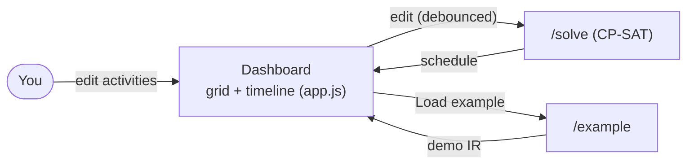

# Architecture

A short tour of the app: what it does, the files, and how each constraint maps to the solver.

---

## 1. What it does

You build a plan by hand — a list of activities, each with a **duration** and a **section**, plus
the rules they must obey. The app turns that into a real **schedule**: start and end times that
respect every rule. If no schedule can satisfy the rules, it says so (**INFEASIBLE**) instead of
handing you a broken plan.

The point is **what-if**: change one input and watch the timeline react. Shorten a break, add a
task, and the timeline redraws so you can see if the day still fits. The flow is two steps:

```
editable JSON (the "IR")  ->  CP-SAT solver  ->  live timeline
  (you edit by hand)          (does the math)    (Gantt chart)
```

1. **You own the JSON (the IR).** The dashboard is a grid of activities grouped into sections, plus
   editable rule cards. This JSON is the single source of truth.
2. **JSON → schedule.** CP-SAT (Google's solver, part of OR-Tools) finds a schedule that satisfies
   every enabled rule, or proves none exists. It re-runs automatically (debounced) on every edit, so
   the timeline is a live mirror of your inputs.

A **section** (Deli, FrontDesk, Crew-A) is one resource — one thing at a time — so two activities
in the same section can't overlap. That's what gives a what-if edit teeth: pile work into one
section and the timeline stretches, or goes red.

Everything runs locally in one small Flask app. No database, no build step, no AI needed.

> *Dormant AI path.* An earlier version drafted the JSON from a plain-English sentence using a local
> Ollama model, then asked you to review it. That `/parse` route still exists but is **off** for the
> manual-entry MVP — it's the only thing that would need Ollama running.

---

## 2. The files and the data flow

| File | Role |
| --- | --- |
| `app.py` | Flask routes: `/` (dashboard), `/solve` (JSON → schedule), `/example[/<name>]` + `/examples` (demo IR). `/parse` is kept but dormant. |
| `models.py` | The IR as Pydantic types — the JSON contract shared by the dashboard and the solver. |
| `solver.py` | The CP-SAT core: turns a `Scenario` into a solver model and solves it. |
| `parse.py` | **Dormant** — the AI path; calls Ollama to turn a sentence into a `Scenario`. |
| `templates/`, `static/` | The vanilla-JS dashboard: an editable grid + a live Gantt timeline. |
| `examples/lake.json` | A hand-written IR so you can test `/solve` with no AI running. |



`static/app.js` holds the IR in one in-memory object and renders it as a section-grouped grid.
Edit a field and a short debounce later it POSTs the whole IR to `/solve`, then draws each
scheduled activity as a bar on the timeline (one lane per section). If an edit makes the schedule
INFEASIBLE, the last good timeline stays on screen (dimmed) with a "that broke it" banner, so the
centerpiece never just vanishes.

### The IR (`models.py`)

The IR is two lists — `activities` and `constraints` — plus an optional `day` window.

- An **`Activity`** is an `id`, a `duration` in minutes, and an optional **`section`**, e.g.
  `{"id": "sail", "duration": 120, "section": "Lake"}`. Activities sharing a section can't overlap.
- A **`Constraint`** has a `type` field saying which of five kinds it is:
  - `time_window` — an `earliest` start and/or `latest_end` for one activity.
  - `no_overlap` — a set of activities (or `"all"`) that can't run at the same time.
  - `precedence` — one activity must finish before another starts.
  - `sequence` — an ordered list where each step finishes before the next. A 3-step sequence is
    just 2 "before" rules behind the scenes (A before B, B before C).
  - `conditional` — a `when`/`then` rule, e.g. *when* kiteboard is absent, *then* double sail.
- Every constraint also carries `enabled` (a toggle to switch it off without deleting it), `label`
  (a title), and `source` (the phrase it came from).
- The optional **`day`** window (`{"start": "08:00", "end": "22:00"}`) bounds *every* activity to
  that span and anchors the schedule to the start. Omit it and activities are free across 0–24h.

---

## 3. How the solver maps the IR

`solver.py` turns each activity into two integer variables — a **start** and **end**, in minutes
from midnight (0–1440) — tied together by an **interval variable** so `start + duration = end`.
Each constraint type then maps to a CP-SAT call:

| IR constraint | CP-SAT call |
| --- | --- |
| `time_window` | `add(start >= earliest)` / `add(end <= latest)` |
| `no_overlap` (and each `section`) | `add_no_overlap([intervals])` |
| `precedence` | `add(end_a <= start_b)` |
| `sequence` | one `add(end <= start)` per adjacent pair |
| `conditional` — optional activity | an optional interval + a presence bool; it only takes up space when present |
| `conditional` — duration change | the size is a variable, fixed with `.only_enforce_if(present)` |

The **objective** maximizes `(DAY + 1) * (activities kept) - span`, so the solver keeps as many
optional activities as possible first, then packs them tightly (`span` = latest end − earliest start).

`solve()` returns a status:

- **OPTIMAL** — found the best valid schedule.
- **INFEASIBLE** — no schedule can satisfy all enabled rules (a proof, not a guess).
- **UNKNOWN** — neither found nor disproved (won't happen on problems this small).

The lake example returns **OPTIMAL**. Force the drive to start no earlier than `21:00` while still
requiring home by `22:00`, and it returns **INFEASIBLE** — those are the two smoke tests below.

---

## 4. Run and test

### Run it

```powershell
python -m venv .venv; .\.venv\Scripts\Activate.ps1
pip install -r requirements.txt
flask --app app run --debug     # dashboard at http://localhost:5000
```

Open the dashboard, click **Load example** (no AI needed), and edit — the timeline updates live.
(Re-enabling `/parse` is the only thing that needs a local Ollama model: `ollama pull granite4.1:8b`.)

### Test it (two smoke tests)

The two tests mirror the two outcomes above. Run them straight through `solve()`, no web layer:

```powershell
# 1. The example must solve -> OPTIMAL
.\.venv\Scripts\python.exe -c "import json; from models import Scenario; from solver import solve; print(solve(Scenario.model_validate(json.load(open('examples/lake.json'))))['status'])"

# 2. The impossible case must be caught -> INFEASIBLE
.\.venv\Scripts\python.exe -c "import json; from models import Scenario; from solver import solve; d=json.load(open('examples/lake.json')); [c.__setitem__('earliest','21:00') for c in d['constraints'] if c['id']=='c1']; print(solve(Scenario.model_validate(d))['status'])"
```

If both come back as expected, constraint handling is sound end to end.
