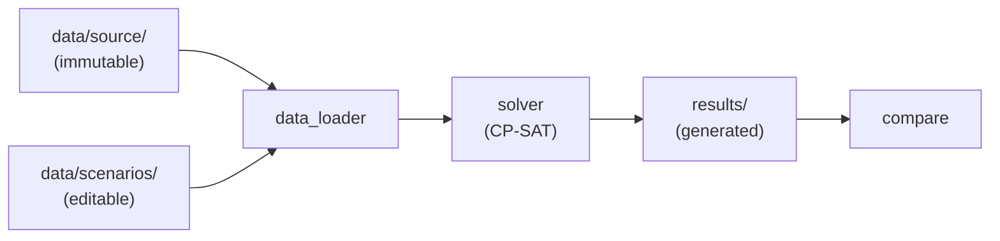

# CLAUDE.md

Guidance for Claude Code working in this repo.

## Goal

This is a **project-based learning** repo. The owner is learning Google OR-Tools **CP-SAT** for
the first time by building a scenario-based personal scheduling optimizer. The code is currently a
**scaffold of stubs** they fill in themselves.

Architecture — three layers:

- `data/source/` — immutable inputs (activities, fixed events). Read-only; never written by code.
- `data/scenarios/` — editable rule sets (one YAML each). The only place rules are changed.
- `results/` — generated schedules (one JSON per solve), compared across scenarios.

## Conventions

**This is a learning project — split work by what actually teaches CP-SAT.**
- The owner hand-writes the **CP-SAT modeling**: `solver.py` and `constraints.py`. Do **not**
  implement these unless explicitly asked — guide with hints and tiny isolated examples; never
  paste a full model solution.
- The **plumbing** (`data_loader.py`, `scenario.py`, `cli.py`, `models.py`) teaches no CP-SAT.
  Fine to implement these when asked.
- Push tight feedback loops: start with a ~20-line throwaway script (build → solve → print →
  break it), then port into the project. Hitting `INFEASIBLE` and debugging it is the point.

**Comments: clean, simple, short.**
One or two lines. Say what a thing does or which CP-SAT call to use — no long docstrings or walls
of prose. Match this style everywhere.

**Keep docs in sync with the code.**
When you change structure, modules, commands, or data shape, update `README.md` **and** the
mermaid diagram (here and in the README) in the *same* change, so they never drift. The diagram
must reflect the real data flow. (For automatic enforcement, a `Stop`/`PostToolUse` hook via
`/update-config` is an option; by default this is a standing instruction.)

**Tooling.**
- Python venv lives in `.venv`. Package is installed editable (`pip install -e .`).
- Lint/format with `ruff check .` and `ruff format .` — keep both clean.
- Keep the source/scenario/result separation intact; never write into `data/`.

## CP-SAT reference

Solver API lives in `ortools.sat.python.cp_model`. Common building blocks:
`CpModel`, `new_int_var`, `new_interval_var`, `new_fixed_size_interval_var`, `add_no_overlap`,
`only_enforce_if`, `add_max_equality`, `minimize`, then `CpSolver().solve(model)`.
Docs: https://developers.google.com/optimization/cp/cp_solver
