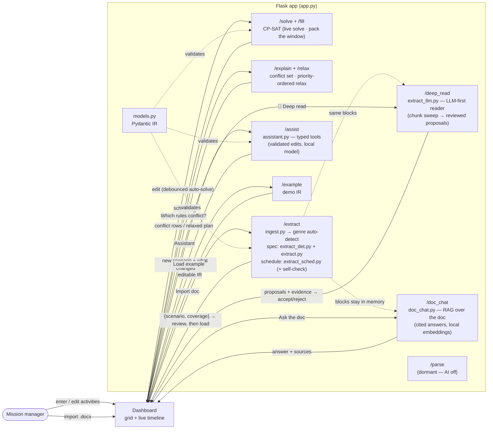

# CP-SAT-PROJECT

A hands-on "what-if" schedule planner. You type activities into a spreadsheet-style grid and a
live timeline shows whether the day still fits. Change one thing — shorten a break, add a second
cleaning — and the timeline redraws by itself, so you can see right away if the plan holds or breaks.

Activities are grouped into **sections** (like Deli, Cheese, FrontDesk — your departments or
stations). The schedule is solved by **CP-SAT** (Google OR-Tools). It's one local Flask app,
Python only — a real, working ops planner.

New to constraint solving? See [ARCHITECTURE.md](ARCHITECTURE.md) for a plain-language tour of the
app and how CP-SAT works.

> Change "break = 1 hour" to "break = 30 min", or "clean toilet ×1" to "×2" — does the day still
> fit, or go red? That question is the whole tool.

## Status

A manual base is working, the schedule spans a custom **multi-day horizon**, and the
**document-ingest** path reads two document genres: a `.docx` requirements **spec** ([VR-xxx] +
"shall") and an ops **schedule** doc (day tables + rule bullets) — the genre is auto-detected and
both flow through the same **review** modal before anything loads. On top of that: a **Fill window**
solve mode (pack the horizon, %-filled per section), **Ask the doc** (Q&A over the imported
document, every answer cites its source blocks), a **plan assistant** (natural-language edits
through typed, validated tools), and a committed test suite (`python run_tests.py`). Everything
AI runs on local Ollama; the app works fine without it.

**The MVP (the goal):** drop in a large document → a local Ollama model parses it into many
activities, each with its own constraints → pick which to add → schedule them across a **multi-day,
custom horizon** (a 6-day trip, 480 hours, a mission length) → a capacity health bar shows whether
you're **over / under / how much time is left**, with the goal of **filling** the window across all
your sections. See [REQUIREMENTS.md](REQUIREMENTS.md) for the North Star + roadmap.

**Working today (the base):**

- The CP-SAT solver — schedules across a custom **horizon** (one 24h day by default, or several
  days) + the editable JSON IR and its 10 constraint types.
- The timeline (Gantt) — **swimlanes**, lane-packed (non-overlapping tasks share a row), **colored by
  activity kind** (sleep/meal/exercise/EVA/comms/ops) with a legend, clean labels with full detail on
  hover, night/comms shading, and a draggable mission-elapsed cursor. A **Group by** picker re-lanes
  the timeline by any real field — **Section · Type · Assignee** (the owner/worker/crew you set per
  activity) — no re-solve. Fitted single-day or multi-day (per-day markers). Plus the "On this plan"
  roster and the searchable Library (with "+ New").
- A capacity health bar (booked **work** — the sum of scheduled minutes — vs. your horizon:
  over / under / time left; "finishes" shows when the plan actually wraps up).
- Live auto-solve; keep the last good timeline (dimmed) when a change breaks it.
- When a plan is INFEASIBLE, a "which rules conflict?" explainer lists the minimal conflicting
  rules (with one-click disable). Load the **Lake day (over-constrained)** example to see it.
- Undo/redo, plus duplicate a plan and export/import it as a JSON file (all local, no cloud).
- **Document ingest, two genres** — import a `.docx` (topbar **📄 Import doc**); `/extract` auto-detects
  the genre. A requirements **spec** runs the deterministic rules-first pass (`ingest.py` →
  `extract_det.py` → `extract.py`): durations, resources, dependencies (both directions:
  "after [X]" and "before / prior to [X]"), dated deadlines, stated operating hours
  (`working_window`), aggregate time caps (`section_budget`), "during/concurrent
  with" overlaps, a `Rationale:` line onto every derived rule, and RFC-2119 priority grading
  (shall=1, should=3, may=5); local Ollama fills **only** a residual field a rule couldn't read.
  Doc-quality tripwires surface in the review modal: ids defined **more than once** are flagged
  (first definition wins, never silently), and off-format cross-references the rules couldn't
  confirm are listed with one-click "add as precedence" in either direction. If the doc carries
  an acronym glossary ("SRME — Synthetic Resource Modeling Engine"), section lanes show the
  long name (`Scenario.section_labels`, display-only).
  An ops **schedule** doc (day tables + rule bullets, see `testdata/artemis_3day_schedule.docx`)
  runs `extract_sched.py`, fully deterministic: the bullets become the RULES (adjacency, max-gaps,
  awake-span caps, buffers, daily windows) and the tables become the ROSTER (recurring vs per-day
  activities) — the printed times are **not** pinned; instead a **self-check** verifies the doc's
  own timetable against the extracted rules and flags any contradiction. Both genres flow through
  the same **review** modal (coverage, warnings, self-check) before loading into a new plan.
- **Fill window** — an on-demand packing solve (`/fill`, topbar **⤒ Fill window**): every activity
  becomes optional and the solver keeps the mix with the most scheduled minutes. The health bar then
  shows **%-filled per section** and what didn't fit. A separate solve path — the live solve loop and
  its objective are untouched.
- **Ask the doc** — Q&A over the last imported document (**💬 Ask the doc**). Local RAG: Ollama
  embeddings (`OLLAMA_EMBED_MODEL`) over the ingested blocks, top-k retrieve, answer with the local
  chat model — and every answer lists the source blocks it used. Extraction never uses RAG (it stays
  a full sweep, so nothing buried in the doc is skipped).
- **Plan assistant** — a chat box (**🤖 Assistant**) that edits the plan through typed tools
  (add/remove activity, change duration, add/toggle a rule, solve, explain-infeasible) via local
  Ollama tool-calling. Every change is validated by the same IR rules as a manual edit, applies
  through undo/redo, live re-solves, and the panel lists exactly what changed.

**Next, toward the MVP (not paused — the actual target):**

- The crew / section model so many sections pack in parallel.
- The priority end-state (weighted / tiered relaxation in its own solve path) — design pending.
- The sentence-to-JSON `/parse` path stays dormant (ingest is document-first, not a chat box).

## How it works

You build the plan by hand, or import a `.docx` requirements spec (see Status) — either way you end
up editing the same IR:

1. Add activities in a grid, each with a **duration** and a **section** (Deli, FrontDesk, …).
2. Each section is treated as **one resource** — it can only do one thing at a time, so two
   activities in the same section can't overlap.
3. Add rules as needed: deadlines and earliest-starts (`time_window`), ordering (`precedence` /
   `sequence`), "one thing at a time" (`no_overlap`), and conditionals.
4. The timeline redraws live as you edit. Green means it fits (**OPTIMAL**). Red means the rules
   clash (**INFEASIBLE**). When it goes red, the last working timeline stays on screen, dimmed,
   with a "that change broke it" note — so you never lose the plan you were reasoning about.

No database, no build step, no npm. One Flask app serves the dashboard (`/`) plus these JSON
endpoints:

- **`/solve`** — takes the IR and returns a schedule from CP-SAT.
- **`/fill`** — the packing solve: every activity optional, keep the most scheduled minutes; returns
  the schedule plus a per-section utilization report and what was left out. On-demand only.
- **`/explain`** — for an INFEASIBLE plan, returns the minimal set of conflicting constraint ids
  (deletion filtering: drop each rule and re-solve). Called on demand, not in the live solve loop.
- **`/relax`** — for an INFEASIBLE plan, greedily drops the **lowest-priority** rules in the conflict
  (never a priority-1 rule) until it solves. On-demand, next to `/explain`.
- **`/extract`** — upload a `.docx`; auto-detects the genre (requirements spec vs ops schedule) and
  returns `{scenario, coverage, warnings}`. The dashboard shows it for **review** before it loads
  into a plan, so a dropped or mis-read rule is caught before anything is scheduled.
- **`/deep_read`** — the LLM-first reader (`extract_llm.py`): the local model sweeps the last
  imported document in overlapping chunks — no ids, headers, or layout assumed — and reports
  scheduling facts as typed notes (tasks, relations by name, recurrence, evidence quotes). A
  consolidation pass resolves them against the deterministic extraction and returns **proposals**
  (`{activities, constraints, couldnt_model}`); the review modal shows each one with a checkbox
  and its quoted sentence — nothing the model says enters the plan unreviewed. On-demand from the
  review modal's **🧠 Deep read** button (503 when Ollama is down).
- **`/doc_chat`** — a question about the last imported document; answers from retrieved blocks with
  the sources attached (local embeddings + local chat model; 503 when Ollama is down).
- **`/assist`** — one assistant turn: the local model edits a copy of the posted scenario through
  typed tools; returns the new scenario + a list of what changed (503 when Ollama is down).
- **`/example[/<name>]`** — returns a hand-written demo scenario; `/examples` lists them.
- **`/parse`** — the old sentence-to-JSON route, kept but **dormant** (AI is off for now).



Data flow: **manual grid entry (grouped by section) → live (debounced) CP-SAT → timeline → tweak
and repeat.** It's a flexible loop, not a waterfall: enter, see the timeline, edit the input, add a
rule, watch it react — in any order.

## Structure

```
CP-SAT-PROJECT/
├── app.py               # Flask: / (dashboard), /solve, /fill (pack the window), /explain, /relax, /extract (.docx ingest, genre auto-detect), /deep_read (LLM-first reader), /doc_chat (ask the doc), /assist (plan assistant), /example[/<name>] + /examples. /parse kept but dormant.
├── models.py            # Pydantic IR: Activity (+ section, display-only assignee/type, provenance label/source) + constraint union — the JSON contract
├── solver.py            # Scenario -> CP-SAT: solve() (live), solve_fill() (pack, separate objective), explain_infeasible(), relax_by_priority()
├── ingest.py            # .docx -> ordered, provenance-tagged blocks (headings, [VR-xxx], dates, "shall", bullets, table cells with row/col); in-memory, zip-bomb-guarded
├── extract_det.py       # deterministic spec rules: duration/resource/dependencies/deadlines/rationale/working-hours/budgets/overlaps (no LLM)
├── extract.py           # genre dispatch + the spec pipeline: rules first, local Ollama ONLY for residual fields; RFC-2119 priority grading
├── extract_sched.py     # schedule-genre extraction: rule bullets + day tables -> rules + roster, plus the doc self-check (no LLM)
├── extract_llm.py       # the LLM-first READER (/deep_read): chunked whole-doc sweep with the local model -> reviewed proposals (never writes into the plan)
├── doc_chat.py          # Ask the doc: local embeddings over the ingested blocks, cited answers (the one RAG feature)
├── assistant.py         # plan assistant: local Ollama tool-calling over typed, IR-validated edit tools
├── parse.py             # DORMANT: local Ollama sentence -> Scenario (AI path, off for the MVP)
├── testdata/            # sample_vehicle_requirements.docx (spec genre, planted VR-512 self-loop) + artemis_3day_schedule.docx (schedule genre) + the spec generator
├── examples/            # lake.json (smoke), lake_infeasible.json (explainer demo), nasa_mission_3day.json, manifest.json
├── tests/               # the pytest suite (solver, IR, extractors, routes, fill, chat, assistant)
├── tests/ui/            # jsdom dashboard tests (node --test); one-time `npm install` there, node_modules stays untracked
├── run_tests.py         # ONE command for everything: backend pytest + the UI tests
├── pytest.ini
├── templates/index.html
├── static/app.js        # the grid + live timeline; edits auto-solve via /solve
├── static/library.json  # runtime data: activity templates + type colors + the timeline's activity-kind palette (icons + id→kind match) + label abbreviations (no content baked into the JS)
├── static/style.css     # dark "mission control" theme (tokens at :root drive the whole look; --kind-* = the activity-kind bar palette)
├── static/artemis-logo.png  # topbar logo
├── static/earthrise.jpg     # darkened background photo behind the app
├── requirements.txt
└── .env.example         # OLLAMA_MODEL= / OLLAMA_EMBED_MODEL= (local models only)
```

`solver.py` is the CP-SAT core — it turns each constraint into a CP-SAT call (`add_no_overlap`,
`only_enforce_if`, time-window bounds…) and serializes each section as a single resource. The rest
(`models.py`, `app.py`, `templates/`, `static/`) is the surrounding plumbing.

## The intermediate format (IR)

One typed JSON document you build and edit by hand. Each constraint `type` maps 1:1 to a CP-SAT
call; `enabled` toggles a rule without losing its numbers. Every constraint also carries a
**`priority`** (1..5, default 1 — 1 = hardest / inviolable, 5 = casual preference) and a
**`rationale`** (free text — the human "why"). Priority does **not** change the live solve — every
enabled rule is still enforced hard there. It only tells the on-demand `/relax` which rules it may
drop (never a priority-1 rule) to make an INFEASIBLE plan fit. The constraint types are:

- `time_window` — an `earliest` start and/or `latest_end` (`"HH:MM"`) for one `activity`. An optional
  `day` (0-based) puts the clock on a chosen mission day, so multi-day deadlines work: *`latest_end`
  18:00, `day` 2* = "ends by 18:00 on the 3rd day". Omit `day` for the day-1 clock (back-compat).
- `no_overlap` — a set of `activities` (or `"all"`) that can't run at the same time.
- `precedence` — one activity (`before`) must finish before another (`after`) starts.
- `sequence` — an ordered chain of `activities`; each one ends before the next begins (the
  multi-activity generalization of `precedence`).
- `overlap` — tie two activities together in time: `mode: "contains"` forces `outer` to fully cover
  `inner` (e.g. comms coverage runs *during* the EVA tasks); `mode: "overlaps"` just makes them
  share time. Unlike `precedence` (which only orders), this pins one activity *onto* another.
- `conditional` — a `when` / `then` rule, e.g. *when* kiteboard is absent, *then* set sail's
  duration ×2.
- `working_window` — open hours for a `section` (or `"all"`): `open` / `close` (`"HH:MM"`). Unlike
  `time_window`'s absolute day-1 clock, these are a **daily** clock that repeats every day across
  the horizon, so activities in that section can only run inside the open hours (the solver forbids
  the closed complement each day; `open >= close` wraps overnight). It's the per-day mechanism; its
  closed bands are shaded on the timeline. (Replaces the old, never-wired `scenario.day`.)
- `section_budget` — a time **budget** for a `section`: the total busy minutes of every activity in
  that section must stay within `max_minutes`. It bounds a sum, not placement, so it only makes a
  plan infeasible when the cap is below the section's fixed total work.
- `time_lag` — a min/max **time lag** between two activities (the standard RCPSP "generalized
  precedence"). The gap is measured from an anchor (`start` or `end`) on `from_id` to an anchor on
  `to_id`, then bounded by `min_lag` and/or `max_lag` (minutes; at least one required). One type
  covers many rules: *X immediately before Y* (adjacency: end→start, min=max=0), *meals ≤ 6h apart*
  (max-gap: `max_lag` 360), *awake ≤ 16h30m* (a span cap). `day_shift` offsets which day is paired
  for recurring activities — `day_shift` 1 links a night-N activity to the next morning (the
  cross-midnight case).
- `min_separation` — keep two activities (`a`, `b`) at least `gap` minutes apart, in **either**
  order. Unlike `no_overlap` (which lets activities touch, end == start), this forces a real buffer
  — e.g. *exercise ≥ 30m from a meal*, *≥ 10m between every activity*.

An **`Activity`** is an `id` and a `duration` in minutes (at least 1), plus (new for the MVP) an
optional **`section`** — free text like `"Deli"`. Activities sharing a section are automatically serialized
(they can't overlap), which is what makes the what-if real: drop a second task into a busy section
and watch the timeline stretch or go red.

It can also carry an optional **`assignee`** — free text for the owner of the work (a worker, a
friend, a crew member). It's **display-only** (the solver ignores it); the timeline's **Group by**
picker can lane the schedule by it, so the same swimlane view works for any domain without baking in
"crew". You set it per activity in the Inspector (with autocomplete from values already in the plan).

When an activity comes from a `.docx` import, two more optional fields ride along for provenance:
**`label`** (the human-readable requirement name) and **`source`** (the exact text it was read from).
Both are **display-only** — the solver ignores them — so every imported activity can be traced back
to the document. Hand-built plans just leave them empty (they default to `""`).

An activity can also set **`recurs_daily: true`** (with an optional **`daily_window`** `{open, close}`
and a `days` filter): the solver then *expands* it into **one occurrence per day** across the horizon,
each clamped to its own day. So one `lunch` with a `daily_window` of `11:00–14:00` lands once on every
mission day — no precedence wiring — instead of all the meals piling onto day 1. This is how the
multi-day demo gets a real daily rhythm. Relative-timing constraints (`precedence`, `overlap`,
`time_lag`, `min_separation`) now **pair recurring activities per day** — resolved through the
per-day occurrence keys — so a rule on a daily activity applies on every day instead of being
silently skipped. (Constraints that pin one absolute id — `time_window`, `conditional` — still match
the source id, which only the per-day occurrences, e.g. `lunch#d2`, expand from.)

Activities run free across the planning **horizon** — one 24h day by default, or set
`"horizon"` (in minutes) on the scenario for a multi-day window (e.g. `2880` = 2 days). Per-activity
`time_window` constraints are what pin them down — their `earliest` / `latest_end` are clock times on
a chosen `day` (0-based; omit it for day 1), so multi-day deadlines like "undock by 18:00 on day 3"
work directly. On a multi-day plan the solver adds a gentle tie-break (minimize the sum of starts),
so free activities land in a deterministic earliest-slot layout instead of solver whim. The scenario
can also carry `section_labels` ({"srme": "Synthetic Resource Modeling Engine"}) — display names for
section ids, filled by doc ingest from the document's own glossary; the solver ignores them.
Full example in `examples/lake.json`:

```jsonc
{
  "activities": [{ "id": "sail", "duration": 120, "section": "Lake" }],
  "constraints": [
    { "id": "c2", "type": "time_window", "activity": "drive_home",
      "latest_end": "22:00", "enabled": true, "label": "Home by 10 PM" },
    { "id": "c4", "type": "sequence", "activities": ["coffee", "shower", "commute"],
      "enabled": true, "label": "First coffee, then shower, then commute" },
    { "id": "c5", "type": "conditional",
      "when": { "activity": "kiteboard", "present": false },
      "then": { "set_duration": { "activity": "sail", "factor": 2 } },
      "enabled": true, "label": "If no kite, sail twice as long" }
  ]
}
```

In the `conditional` above, `factor: 2` means double the activity's duration, and
`present: false` means "when kiteboard is left out of the schedule."

## Setup & run

```powershell
python -m venv .venv; .\.venv\Scripts\Activate.ps1
pip install -r requirements.txt
flask --app app run --debug     # dashboard at http://localhost:5000
```

Run the whole test suite with one command:

```powershell
python run_tests.py             # backend pytest + the jsdom UI tests
```

(The UI part needs Node plus a one-time `npm install` inside `tests/ui`; without it, that part
reports SKIP and the backend tests still run.)

No AI and no API key are needed for the core — the dashboard, `/solve`, `/fill`, and `/example` run
with nothing external, and a `.docx` import is deterministic for both genres. The AI features (the
extraction residual fallback, **Ask the doc**, the **assistant**) need local Ollama:
`ollama pull granite4.1:8b` (chat, override with `OLLAMA_MODEL`) and
`ollama pull nomic-embed-text` (embeddings, override with `OLLAMA_EMBED_MODEL`). When Ollama is
down those features answer with a clean error and everything else keeps working.

## Notes

- Local-only — no database, no auth, no hosting (privacy: data stays on the machine; an imported
  `.docx` is parsed in memory and never leaves the machine; the doc blocks for Ask-the-doc live in
  process memory only).
- Three separate AI mechanisms, all local Ollama: doc **extraction** is a deterministic full sweep
  (LLM only for residual fields — never RAG, so nothing buried in a long doc is skipped);
  **Ask the doc** is the one RAG feature (retrieval + cited answers); the **assistant** is
  tool-calling (typed, validated edits). The sentence-based `/parse` chat path stays dormant.
- The **Fill window** packer is its own solve path (`solve_fill`); the live solve's keep−tidy
  objective is deliberately left untouched.
- A first pass of the `.docx` ingest pipeline is revived from `archive/advanced-multiday-classifier`
  (see `ingest.py` / `extract_det.py` / `extract.py`); the rest of that branch (the schedule-vs-context
  classifier, recurrence) stays there for later.
