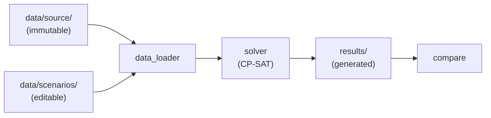

# CP-SAT-PROJECT

A learning project: a scenario-based **personal scheduling optimizer** built on Google OR-Tools
**CP-SAT**. The code is a **scaffold of stubs with guidance comments** — you implement it yourself
to learn CP-SAT.

**Goal:** keep your original data untouched, put every tunable rule in a separate scenario file,
and let CP-SAT show what an optimal day looks like under each rule — so you can ask *"what changes
if I only wait 30 minutes after a meal instead of 60 before exercising?"* and compare the answers.

## The three layers

| Layer | Folder | Mutability | Purpose |
|-------|--------|------------|---------|
| **Source** | `data/source/` | Immutable (read-only) | Your original inputs: activities, meals, fixed events |
| **Scenario** | `data/scenarios/` | Editable | One YAML per rule set; the only thing you edit to change constraints |
| **Result** | `results/` | Generated | One JSON per solve; compared across scenarios |



## Build order (implement the stubs)

1. `src/cpsat_scheduler/models.py` — define the dataclass fields.
2. `data_loader.py` — read the YAML into those models.
3. `constraints.py` — one function per rule (windows, no-overlap, meal→exercise gap).
4. `solver.py` — **the core**: build the CP-SAT model, solve, return a result.
5. `scenario.py` / `compare.py` — run + save a scenario, then diff two results.
6. `cli.py` — wire up `list` / `solve` / `compare`.

Fill in `data/source/*.yaml` and copy `data/scenarios/example.yaml` for your own scenarios.

## Setup

```powershell
python -m venv .venv
.\.venv\Scripts\Activate.ps1
pip install -r requirements-dev.txt
pip install -e .
```

(Already set up in `.venv`.) Lint/format with `ruff check .` and `ruff format .`.

## Intended usage (once implemented)

```powershell
python -m cpsat_scheduler list                 # list scenarios
python -m cpsat_scheduler solve example        # solve -> results/example.json
python -m cpsat_scheduler compare a b          # diff two solved scenarios
```
