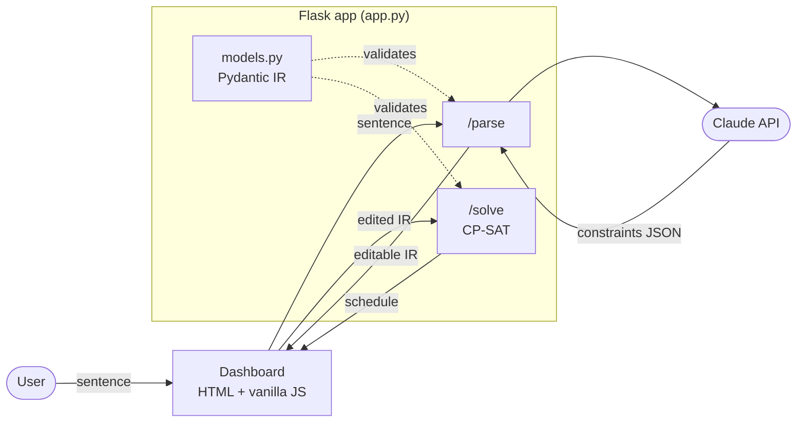

# CP-SAT-PROJECT

A **natural-language scheduling optimizer**: type a plain-English description of your day,
watch it become editable constraint blocks, and let **CP-SAT** (Google OR-Tools) find a
schedule that fits — or prove none exists. One local Flask app, Python only. Learning /
portfolio project.

> _"Go to Lake Michigan, leave after 8 AM, grab a hamburger, sail, maybe kiteboard — and if I
> can't kiteboard, sail twice as long — be home by 10 PM."_ → a solved, editable timetable.

## How it works

Claude turns the sentence into a **typed JSON** list of constraints. You review and edit the
numbers in the dashboard; CP-SAT re-solves instantly. The LLM only *drafts* — the JSON is the
source of truth and you approve it. That review step is the reliability move: an LLM can return
a clean-looking schedule while silently dropping a rule, so we validate the **constraints**,
not just the result. Every constraint carries the `source` phrase it came from.

One Flask app serves the dashboard plus two JSON endpoints — `/parse` (sentence → JSON via
Claude) and `/solve` (JSON → schedule via CP-SAT). No build step, no npm, no database.



Data flow: **sentence → (Claude) → editable JSON → (you tweak) → CP-SAT → schedule → repeat.**

## Structure

```
CP-SAT-PROJECT/
├── app.py               # Flask: / (dashboard), /parse (Claude), /solve (CP-SAT)
├── models.py            # Pydantic IR: Activity + constraint union — the JSON contract
├── parse.py             # Claude: sentence -> validated Scenario
├── solver.py            # ← YOU write: Scenario -> CP-SAT -> schedule
├── examples/lake.json   # hand-written IR to test /solve without the LLM
├── templates/index.html
├── static/app.js        # fetch /parse + /solve, render cards + Gantt
├── static/style.css
├── requirements.txt
└── .env.example         # ANTHROPIC_API_KEY=
```

**What you write vs. plumbing**
- **Yours (the CP-SAT you're here to learn):** `solver.py` — translate each constraint into a
  CP-SAT call (`add_no_overlap`, `only_enforce_if`, time-window bounds…).
- **Plumbing (already scaffolded):** `models.py`, `parse.py`, `app.py`, `templates/`, `static/`.

## The intermediate format (IR)

One typed JSON document the LLM produces and you edit. Each constraint `type` maps 1:1 to a
CP-SAT call; `enabled` toggles a rule without losing its numbers; `source` is the phrase it
came from. Full example in `examples/lake.json`:

```jsonc
{
  "activities": [{ "id": "sail", "duration": 120 }],
  "constraints": [
    { "id": "c2", "type": "time_window", "activity": "drive_home",
      "latest_end": "22:00", "enabled": true, "label": "Home by 10 PM" },
    { "id": "c5", "type": "conditional",
      "when": { "activity": "kiteboard", "present": false },
      "then": { "set_duration": { "activity": "sail", "factor": 2 } },
      "enabled": true, "label": "If no kite, sail twice as long" }
  ]
}
```

## Setup & run

```powershell
python -m venv .venv; .\.venv\Scripts\Activate.ps1
pip install -r requirements.txt
copy .env.example .env          # then paste your ANTHROPIC_API_KEY
flask --app app run --debug     # dashboard at http://localhost:5000
```

The dashboard and `/solve` work without an API key; only `/parse` needs Claude.

## Notes

- Local-only portfolio/demo — no database, no auth, no hosting.
- Build order that never blocks you: `models.py` → `solver.py` (test with `examples/lake.json`)
  → dashboard → `/parse` (Claude) last. The app works end-to-end before the LLM exists.
