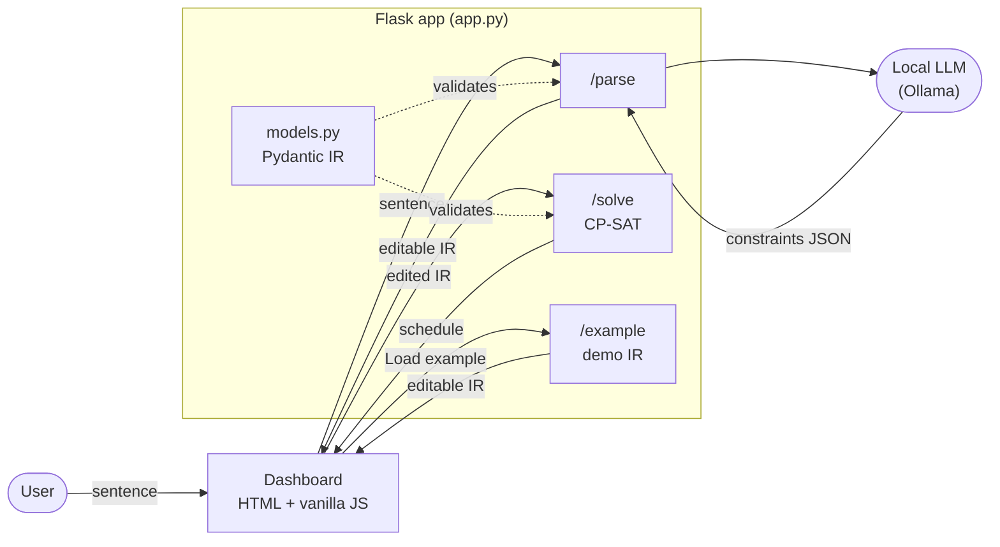

# CP-SAT-PROJECT

A **natural-language scheduling optimizer**: type a plain-English description of your day,
watch it become editable constraint blocks, and let **CP-SAT** (Google OR-Tools) find a
schedule that fits — or prove none exists. One local Flask app, Python only. Learning /
portfolio project.

New to constraint solving? See [ARCHITECTURE.md](ARCHITECTURE.md) for a gentle, plain-language tour of the app and how CP-SAT works.

> _"Go to Lake Michigan, leave after 8 AM, grab a hamburger, sail, maybe kiteboard — and if I
> can't kiteboard, sail twice as long — be home by 10 PM."_ → a solved, editable timetable.

## How it works

A **local LLM** — run via [Ollama](https://ollama.com), no API key — turns the sentence into a
**typed JSON** list of constraints. You review and edit the
numbers in the dashboard; CP-SAT re-solves instantly. The LLM only *drafts* — the JSON is the
source of truth and you approve it. That review step is the reliability move: an LLM can return
a clean-looking schedule while silently dropping a rule, so we validate the **constraints**,
not just the result. Every constraint carries the `source` phrase it came from.

One Flask app serves the dashboard (`/`) plus a handful of JSON endpoints — `/parse` (sentence →
JSON via a local Ollama model), `/solve` (JSON → schedule via CP-SAT), `/example` (and
`/example/<name>`, the hand-written demo IR so the dashboard is usable without the LLM), and
`/examples` (the manifest that fills the dashboard's example dropdown). No build step, no npm, no
database.



Data flow: **sentence → (local LLM) → editable JSON → (you tweak) → CP-SAT → schedule → repeat.**

## Structure

```
CP-SAT-PROJECT/
├── app.py               # Flask: / (dashboard), /parse (Ollama), /solve (CP-SAT), /example[/<name>] (demo IR), /examples (manifest)
├── models.py            # Pydantic IR: Activity + constraint union — the JSON contract
├── parse.py             # local Ollama model: sentence -> validated Scenario
├── solver.py            # Scenario -> CP-SAT -> schedule
├── examples/lake.json   # hand-written IR to test /solve without the LLM
├── templates/index.html
├── static/app.js        # fetch /parse + /solve, render cards + Gantt
├── static/style.css
├── requirements.txt
└── .env.example         # OLLAMA_MODEL= (optional local-model override)
```

`solver.py` is the CP-SAT core — it translates each constraint into a CP-SAT call
(`add_no_overlap`, `only_enforce_if`, time-window bounds…); the rest (`models.py`, `parse.py`,
`app.py`, `templates/`, `static/`) is the surrounding plumbing.

## The intermediate format (IR)

One typed JSON document the LLM produces and you edit. Each constraint `type` maps 1:1 to a
CP-SAT call; `enabled` toggles a rule without losing its numbers; `source` is the phrase it
came from. The five constraint types are:

- `time_window` — an `earliest` start and/or `latest_end` (`"HH:MM"`) for one `activity`.
- `no_overlap` — a set of `activities` (or `"all"`) that can't run at the same time.
- `precedence` — one activity (`before`) must finish before another (`after`) starts.
- `sequence` — an ordered chain of `activities`; each one ends before the next begins. It's the
  multi-activity generalization of `precedence`, so ordering phrasing ("first A, then B, finally
  C") becomes one editable rule instead of a pile of pairwise ones.
- `conditional` — a `when` / `then` rule, e.g. *when* kiteboard is absent, *then* set sail's
  duration ×2.

An optional `day` (a `DayWindow` with `start`/`end` as `"HH:MM"`) bounds *every*
activity to the day's span and anchors the schedule to its start; omit it and activities run free
across the full 24h day. Full example in `examples/lake.json`:

```jsonc
{
  "day": { "start": "08:00", "end": "22:00" },   // optional; bounds all activities
  "activities": [{ "id": "sail", "duration": 120 }],
  "constraints": [
    { "id": "c2", "type": "time_window", "activity": "drive_home",
      "latest_end": "22:00", "enabled": true, "label": "Home by 10 PM" },
    { "id": "c4", "type": "sequence", "activities": ["coffee", "shower", "commute"],
      "enabled": true, "label": "First coffee, then shower, then commute" },
    { "id": "c5", "type": "conditional",
      "when": { "activity": "kiteboard", "present": false },
      "then": { "set_duration": { "activity": "sail", "factor": 2 } },
      "enabled": true, "label": "If no kite, sail twice as long" }
  ]
}
```

## Setup & run

```powershell
python -m venv .venv; .\.venv\Scripts\Activate.ps1
pip install -r requirements.txt
ollama pull granite4.1:8b       # install Ollama from ollama.com first; one-time ~5.3 GB download
flask --app app run --debug     # dashboard at http://localhost:5000
```

No API key needed — `/parse` calls a **local** model through Ollama (override with the
`OLLAMA_MODEL` env var). The dashboard, `/solve`, and `/example` work even with Ollama stopped.

## Notes

- Local-only portfolio/demo — no database, no auth, no hosting.
- No cloud, no API key: `/parse` runs a local Ollama model (offline); `/solve` and the dashboard
  work even without it (test with `examples/lake.json`).
