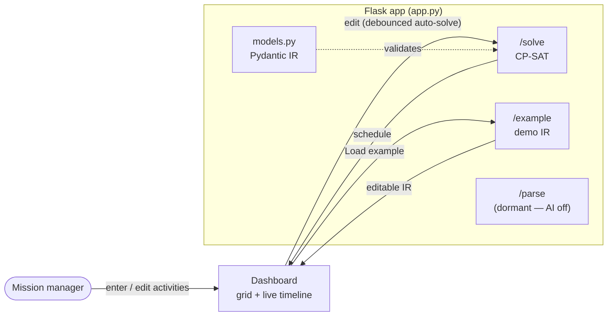

# CP-SAT-PROJECT

A hands-on "what-if" schedule planner. You type activities into a spreadsheet-style grid and a
live timeline shows whether the day still fits. Change one thing — shorten a break, add a second
cleaning — and the timeline redraws by itself, so you can see right away if the plan holds or breaks.

Activities are grouped into **sections** (like Deli, Cheese, FrontDesk — your departments or
stations). The schedule is solved by **CP-SAT** (Google OR-Tools). It's one local Flask app,
Python only — a portfolio project.

New to constraint solving? See [ARCHITECTURE.md](ARCHITECTURE.md) for a plain-language tour of the
app and how CP-SAT works.

> Change "break = 1 hour" to "break = 30 min", or "clean toilet ×1" to "×2" — does the day still
> fit, or go red? That question is the whole tool.

## Status

The engine is already built. The manual what-if UI is being built on top of it.

**Done:**

- The single-day CP-SAT solver.
- The editable JSON IR and its 5 constraint types.
- The timeline (Gantt chart).
- The example scenarios.
- Live editing of the rules.

**Building now (the MVP):**

- Activities grouped into sections, where each section can do one thing at a time.
- An Excel-style grid to enter them.
- Live auto-solve as you edit.
- Keep the last good timeline (dimmed) when a change breaks it.
- A small slack readout — how much room is left in the day.

**Paused (kept, not deleted):**

- AI sentence parsing (Ollama).
- Multi-day scheduling.
- `.docx` import.

## How it works

You build the plan by hand — no AI, no typing sentences:

1. Add activities in a grid, each with a **duration** and a **section** (Deli, FrontDesk, …).
2. Each section is treated as **one resource** — it can only do one thing at a time, so two
   activities in the same section can't overlap.
3. Add rules as needed: deadlines and earliest-starts (`time_window`), ordering (`precedence` /
   `sequence`), "one thing at a time" (`no_overlap`), and conditionals.
4. The timeline redraws live as you edit. Green means it fits (**OPTIMAL**). Red means the rules
   clash (**INFEASIBLE**). When it goes red, the last working timeline stays on screen, dimmed,
   with a "that change broke it" note — so you never lose the plan you were reasoning about.

No database, no build step, no npm. One Flask app serves the dashboard (`/`) plus these JSON
endpoints:

- **`/solve`** — takes the IR and returns a schedule from CP-SAT.
- **`/example[/<name>]`** — returns a hand-written demo scenario; `/examples` lists them.
- **`/parse`** — the old sentence-to-JSON route, kept but **dormant** (AI is off for now).



Data flow: **manual grid entry (grouped by section) → live (debounced) CP-SAT → timeline → tweak
and repeat.** It's a flexible loop, not a waterfall: enter, see the timeline, edit the input, add a
rule, watch it react — in any order.

## Structure

```
CP-SAT-PROJECT/
├── app.py               # Flask: / (dashboard), /solve (CP-SAT), /example[/<name>] + /examples (demo IR). /parse kept but dormant.
├── models.py            # Pydantic IR: Activity (+ section) + constraint union — the JSON contract
├── solver.py            # Scenario -> CP-SAT -> schedule (single-day); each section becomes a one-at-a-time resource
├── parse.py             # DORMANT: local Ollama sentence -> Scenario (AI path, off for the MVP)
├── examples/lake.json   # hand-written IR to test /solve without any AI
├── templates/index.html
├── static/app.js        # the grid + live timeline; edits auto-solve via /solve
├── static/style.css
├── requirements.txt
└── .env.example         # OLLAMA_MODEL= (only for the dormant AI path)
```

`solver.py` is the CP-SAT core — it turns each constraint into a CP-SAT call (`add_no_overlap`,
`only_enforce_if`, time-window bounds…) and serializes each section as a single resource. The rest
(`models.py`, `app.py`, `templates/`, `static/`) is the surrounding plumbing.

## The intermediate format (IR)

One typed JSON document you build and edit by hand. Each constraint `type` maps 1:1 to a CP-SAT
call; `enabled` toggles a rule without losing its numbers. The five constraint types are:

- `time_window` — an `earliest` start and/or `latest_end` (`"HH:MM"`) for one `activity`.
- `no_overlap` — a set of `activities` (or `"all"`) that can't run at the same time.
- `precedence` — one activity (`before`) must finish before another (`after`) starts.
- `sequence` — an ordered chain of `activities`; each one ends before the next begins (the
  multi-activity generalization of `precedence`).
- `conditional` — a `when` / `then` rule, e.g. *when* kiteboard is absent, *then* set sail's
  duration ×2.

An **`Activity`** is an `id` and a `duration` in minutes, plus (new for the MVP) an optional
**`section`** — free text like `"Deli"`. Activities sharing a section are automatically serialized
(they can't overlap), which is what makes the what-if real: drop a second task into a busy section
and watch the timeline stretch or go red.

An optional `day` (a `DayWindow` with `start`/`end` as `"HH:MM"`) bounds *every* activity to the
day's span and anchors the schedule to its start; omit it and activities run free across the full
24h day. Full example in `examples/lake.json`:

```jsonc
{
  "day": { "start": "08:00", "end": "22:00" },   // optional; bounds all activities
  "activities": [{ "id": "sail", "duration": 120, "section": "Lake" }],
  "constraints": [
    { "id": "c2", "type": "time_window", "activity": "drive_home",
      "latest_end": "22:00", "enabled": true, "label": "Home by 10 PM" },
    { "id": "c4", "type": "sequence", "activities": ["coffee", "shower", "commute"],
      "enabled": true, "label": "First coffee, then shower, then commute" },
    { "id": "c5", "type": "conditional",
      "when": { "activity": "kiteboard", "present": false },
      "then": { "set_duration": { "activity": "sail", "factor": 2 } },
      "enabled": true, "label": "If no kite, sail twice as long" }
  ]
}
```

In the `conditional` above, `factor: 2` means double the activity's duration, and
`present: false` means "when kiteboard is left out of the schedule."

## Setup & run

```powershell
python -m venv .venv; .\.venv\Scripts\Activate.ps1
pip install -r requirements.txt
flask --app app run --debug     # dashboard at http://localhost:5000
```

No AI and no API key are needed for the MVP — the dashboard, `/solve`, and `/example` run with
nothing external. (The dormant AI path needs Ollama: `ollama pull granite4.1:8b`, override the
model with `OLLAMA_MODEL` — only if you re-enable `/parse`.)

## Notes

- Local-only portfolio/demo — no database, no auth, no hosting.
- Manual entry only for the MVP; the AI sentence-parsing path is kept dormant, not removed.
- The advanced version (multi-day, `.docx` import, document extraction) lives on the branch
  `archive/advanced-multiday-classifier` if it's ever needed again.
