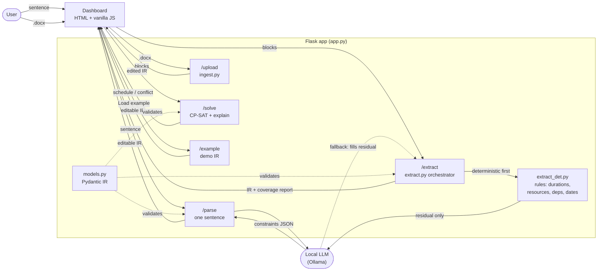

# CP-SAT-PROJECT

A **natural-language scheduling optimizer**: type a plain-English description of your day —
*or upload a 15-page requirements document* — watch it become editable constraint blocks, and let
**CP-SAT** (Google OR-Tools) find a schedule that fits — or prove none exists and name the
conflicting rules. Schedules span a single day *or* many weeks. One local Flask app, Python only.
Learning / portfolio project.

New to constraint solving? See [ARCHITECTURE.md](ARCHITECTURE.md) for a gentle, plain-language tour of the app and how CP-SAT works.

> _"Go to Lake Michigan, leave after 8 AM, grab a hamburger, sail, maybe kiteboard — and if I
> can't kiteboard, sail twice as long — be home by 10 PM."_ → a solved, editable timetable.

## How it works

A **local LLM** — run via [Ollama](https://ollama.com), no API key — turns the sentence into a
**typed JSON** list of constraints. You review and edit the
numbers in the dashboard; CP-SAT re-solves instantly. The LLM only *drafts* — the JSON is the
source of truth and you approve it. That review step is the reliability move: an LLM can return
a clean-looking schedule while silently dropping a rule, so we validate the **constraints**,
not just the result. Every constraint carries the `source` phrase it came from.

There are **two ways in**. For a quick day, type a **sentence** → `/parse`. For a real project,
upload a **`.docx`** → `/upload` extracts structured blocks (locally, with python-docx), then
`/extract` reads the document's structured signal with **rules first** — durations, resources,
dependencies, and dated milestones via regex over the ordered blocks — and calls the local model
**only for the residue** rules can't resolve, merging one activity per `[VR-xxx]` into one large
multi-day `Scenario`. So a 15-page spec extracts in well under a second with zero model calls,
instead of minutes. Both paths land in the same editable JSON, which you review and send
to `/solve` (CP-SAT). One Flask app serves the dashboard (`/`) plus these JSON endpoints — `/parse`,
`/upload`, `/extract` (streams progress), `/solve` (attaches a conflict explanation when INFEASIBLE),
`/example[/<name>]` (hand-written demo IR), and `/examples` (the dropdown manifest). No build step,
no npm, no database — and nothing leaves the machine.



Data flow: **sentence *or* .docx → (local LLM) → editable JSON → (you review) → CP-SAT → schedule (or
named conflict) → repeat.**

## Structure

```
CP-SAT-PROJECT/
├── app.py               # Flask: / (dashboard), /parse, /upload, /extract, /solve, /example[/<name>], /examples
├── models.py            # Pydantic IR: Activity + constraint union + Moment time + multi-day fields — the JSON contract
├── parse.py             # local Ollama model: ONE sentence -> validated Scenario (single-day path)
├── ingest.py            # python-docx: a .docx -> ordered structured blocks (section, requirement ids, dates), with provenance
├── extract_det.py       # deterministic backbone: blocks -> activities + constraints (durations, resources, deps, dates) by regex, no LLM
├── extract.py           # deterministic-first orchestrator: rules first, local LLM only on the residual; emits a method-tagged coverage report
├── bench_extract.py     # before/after extraction benchmark + regression harness (wall-clock, LLM calls, edge count)
├── solver.py            # Scenario -> CP-SAT -> schedule (single-day OR multi-day); explain_infeasibility names conflicts
├── smoke.py             # runnable green-gate tests + verify_schedule (asserts every constraint holds)
├── examples/lake.json   # hand-written single-day IR to test /solve without the LLM
├── examples/project.json # hand-written multi-day IR (10-day project: resources, a deadline, a conditional)
├── testdata/make_sample_docx.py  # generates a ~15-page synthetic requirements .docx for testing ingestion
├── templates/index.html
├── static/             # vanilla-JS dashboard — framework-free, no build step, classic <script> modules
│   ├── core.js         #   shared: state, network, render() dispatcher, DOM helpers
│   ├── editor.js       #   editable activity/constraint cards + Moment & sequence editors
│   ├── gantt.js        #   single-day chart + zoomable, section-grouped multi-day timeline
│   ├── coverage.js     #   the coverage / trust panel (method tags, edges, audit)
│   ├── upload.js       #   .docx drag-drop + SSE-streamed extraction state machine
│   ├── main.js         #   wires the modules together (loaded last)
│   └── style.css       #   one hand-written CSS file (design tokens + per-area sections)
├── requirements.txt
└── .env.example         # OLLAMA_MODEL= (optional local-model override)
```

`solver.py` is the CP-SAT core — it translates each constraint into a CP-SAT call
(`add_no_overlap`, `only_enforce_if`, time-window bounds, a makespan objective for multi-day…); the
rest (`models.py`, `parse.py`, `ingest.py`, `extract_det.py`, `extract.py`, `app.py`, `templates/`,
`static/`) is the surrounding plumbing. The document path is **deterministic-first**: `extract_det.py`
reads each `[VR-xxx]` requirement's duration, resource, dependencies, and dated deadlines by regex
over the ordered blocks, and `extract.py` calls the local LLM **only on the residual** rules can't
resolve (often zero requirements). Every requirement found in the doc becomes an activity with its
real source text and is reconciled in a coverage report that records **how each item was resolved**
(deterministic / llm / default) — so the local model is a scoped fallback that can never silently
drop a requirement, and a well-formed spec needs no model call at all.

## The intermediate format (IR)

One typed JSON document the LLM produces and you edit. Each constraint `type` maps 1:1 to a
CP-SAT call; `enabled` toggles a rule without losing its numbers; `source` is the phrase it
came from. The five constraint types are:

- `time_window` — an `earliest` start and/or `latest_end` (`"HH:MM"`) for one `activity`.
- `no_overlap` — a set of `activities` (or `"all"`) that can't run at the same time.
- `precedence` — one activity (`before`) must finish before another (`after`) starts.
- `sequence` — an ordered chain of `activities`; each one ends before the next begins. It's the
  multi-activity generalization of `precedence`, so ordering phrasing ("first A, then B, finally
  C") becomes one editable rule instead of a pile of pairwise ones.
- `conditional` — a `when` / `then` rule, e.g. *when* kiteboard is absent, *then* set sail's
  duration ×2.

An optional `day` (a `DayWindow` with `start`/`end` as `"HH:MM"`) bounds *every*
activity to the day's span and anchors the schedule to its start; omit it and activities run free
across the full 24h day.

**Multi-day.** The same IR scales from one day to many weeks. A time is a **`Moment`**: a bare
`"HH:MM"` (= day 0, today) *or* `{"day": N, "time": "HH:MM"}` — so `time_window` deadlines can land
on day 12. A day-0 Moment serializes back to a plain `"HH:MM"`, so single-day scenarios are
unchanged. The `Scenario` gains an optional `start_date` (`"YYYY-MM-DD"`, display-only calendar
labels) and `horizon_days` (bounds the horizon). An `Activity` gains `label`, `source` (provenance),
`section` (heading breadcrumb, used to group the timeline), and `resource` (activities sharing a
resource get an automatic `no_overlap`). The solver picks the multi-day path when `horizon_days` is
set or any Moment lands beyond day 0, minimizing **makespan** under a time limit; otherwise it takes
the original single-day path verbatim. See `examples/project.json`. The single-day example follows
in `examples/lake.json`:

```jsonc
{
  "day": { "start": "08:00", "end": "22:00" },   // optional; bounds all activities
  "activities": [{ "id": "sail", "duration": 120 }],
  "constraints": [
    { "id": "c2", "type": "time_window", "activity": "drive_home",
      "latest_end": "22:00", "enabled": true, "label": "Home by 10 PM" },
    { "id": "c4", "type": "sequence", "activities": ["coffee", "shower", "commute"],
      "enabled": true, "label": "First coffee, then shower, then commute" },
    { "id": "c5", "type": "conditional",
      "when": { "activity": "kiteboard", "present": false },
      "then": { "set_duration": { "activity": "sail", "factor": 2 } },
      "enabled": true, "label": "If no kite, sail twice as long" }
  ]
}
```

## Setup & run

```powershell
python -m venv .venv; .\.venv\Scripts\Activate.ps1
pip install -r requirements.txt
ollama pull granite4.1:8b       # install Ollama from ollama.com first; one-time ~5.3 GB download
flask --app app run --debug     # dashboard at http://localhost:5000
```

No API key needed — `/parse` and `/extract` call a **local** model through Ollama (override with the
`OLLAMA_MODEL` env var). The dashboard, `/solve`, `/upload`, and `/example` work even with Ollama
stopped. Verify everything with `python smoke.py` (the green gate).

To try the document path: generate the sample spec with `python testdata/make_sample_docx.py`, then
in the dashboard upload `testdata/sample_vehicle_requirements.docx` → review the coverage report →
**Solve**. To see the deterministic-first speedup, run `python bench_extract.py` (before/after
extraction benchmark + regression harness). Multi-day solver knobs (env): `SOLVER_BUCKET_MINUTES` (default 15), `SOLVER_TIME_LIMIT_SECONDS` (10), `SOLVER_WORKERS` (8).

## Demo (2 minutes)

The throughline: **the LLM is supervised, not trusted.** It only *drafts* rules — you review them,
CP-SAT does the math, and a coverage report proves nothing was dropped. The demo has a fast hook
(a sentence) and a payoff (a 15-page document whose extraction you can audit). Everything below
works with **Ollama stopped** except typing a brand-new sentence. If
`testdata/sample_vehicle_requirements.docx` is missing, run `python testdata/make_sample_docx.py`.

**Part 1 — the hook: a sentence → a solved day (~30s)**

1. Either **type** the sentence and click **Parse →** (needs Ollama):
   *"Go to the lake, leave after 8 AM, sail, maybe kiteboard — and if I can't kiteboard, sail twice
   as long — be home by 10 PM."* …or pick **"Lake day"** from *Load an example* (no model needed).
2. Point at the editable cards: each rule shows its **type badge**, an **enable/disable** toggle,
   and the **source phrase** it came from. *"This review step is the whole point — an LLM can hand
   you a clean-looking schedule that silently dropped a rule."*
3. Click **Solve** → a single-day Gantt, **OPTIMAL**. Tighten one window (set the drive's *earliest*
   to `21:00`) and **Solve** again → **INFEASIBLE**, with the clashing time-window cards outlined.

**Part 2 — the payoff: a 15-page spec → an audited multi-day plan (~90s)**

4. Drag `testdata/sample_vehicle_requirements.docx` into the import area (or click to browse).
   Deterministic-first extraction returns in well under a second — the step chips flash
   *Scan → Extract → Review*.
5. **Stop on the Coverage panel — the centerpiece.** Walk it: the hero reads **29 / 29
   requirements · 0 dropped** with a **"Fully deterministic — 0 model calls"** badge; the **method
   breakdown** bars split durations/resources into **deterministic / llm / default** (all read by
   rules here); **28 dependency edges**, all deterministic; and the **cross-reference audit** —
   references the rules deliberately did *not* turn into edges, *surfaced for human review, never
   auto-added*.
6. Scroll the editor — every activity carries its **`source`** phrase from the doc; spot-check one.
7. Click **Solve** → **INFEASIBLE**. The explainer names exactly one rule, **"VR-512 after
   VR-512"** (a planted self-dependency), and red-outlines that card. *"Across 30 requirements it
   tells you which rule is impossible, not just that something is."*
8. Untick that card's **enable** toggle and **Solve** again → **OPTIMAL**: all **29 tasks** across
   a multi-week timeline. **Zoom**, **scroll** the weeks (day + heavier week gridlines with calendar
   dates), **collapse a section**, and **hover a bar** for its label / section / source / span.

**Close:** *two ways in — a sentence or a 15-page spec — both land in the same editable, typed JSON
you approve before solving. The reliability move isn't a better model; it's making every rule
visible, sourced, and provably accounted for. All local — nothing leaves the machine.*

## Notes

- Local-only portfolio/demo — no database, no auth, no hosting; `.docx` is parsed in-memory (never written to disk).
- No cloud, no API key: `/parse` and `/extract` run a local Ollama model (offline); `/solve`, `/upload`,
  and the dashboard work even without it (test with `examples/lake.json` / `examples/project.json`).
- **Trust, not magic.** Extraction is **deterministic-first**: rules read a well-formed spec in well
  under a second with no model call, and the local model is a scoped fallback only for the residue
  rules can't resolve. The document path always shows a **coverage report** — every requirement
  accounted for, every item keeping its `source`, and now a record of **how each item was resolved**
  (deterministic / llm / default). Reviewing it is part of the workflow: a signal-poor doc (no stated
  durations/dates) still leans on the model fallback, which invents them, so the timeline is partly a
  draft. The reliability move is making each rule visible and editable, not trusting the model's answer.
