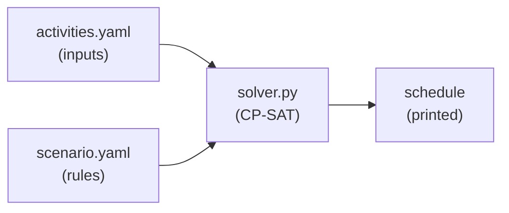

# CP-SAT-PROJECT

A learning project: a tiny **personal scheduling optimizer** built on Google OR-Tools
**CP-SAT**. You write the model yourself — that's the point.

**The scenario:** plan a day at the lake. Drive there, grab a hamburger, sail, maybe
kiteboard, drive home — without overlaps, inside a time window, and *if you skip
kiteboarding, sail twice as long*. CP-SAT finds a schedule that fits the rules, or proves
none exists.

## Files

| File | What it is |
|------|------------|
| `scratch.py` | **Start here.** Throwaway: build → solve → print → break it. |
| `solver.py` | The real model, once scratch works. *You write the CP-SAT part.* |
| `activities.yaml` | Inputs: the activities + durations. Facts, not rules. |
| `scenario.yaml` | The rules you edit: time windows, kite→sail logic. |



## Setup

```powershell
python -m venv .venv
.\.venv\Scripts\Activate.ps1
pip install ortools pyyaml
```

## How to work

1. Open `scratch.py`. Hardcode 2–3 activities, build a model, solve, print.
2. Add `add_no_overlap` and a time window. Make it `INFEASIBLE` on purpose, then fix it.
3. Once it works, port the clean version into `solver.py` and wire up the YAML files.

Grow the structure only when it hurts: add a `results/` folder when you start comparing
scenarios; split a `constraints.py` out of `solver.py` when one file feels too long.

## CP-SAT reference

`ortools.sat.python.cp_model`: `CpModel`, `new_int_var`, `new_interval_var`,
`new_fixed_size_interval_var`, `add_no_overlap`, `only_enforce_if`, `add_max_equality`,
`minimize`, `CpSolver().solve(model)`.
Docs: https://developers.google.com/optimization/cp/cp_solver
